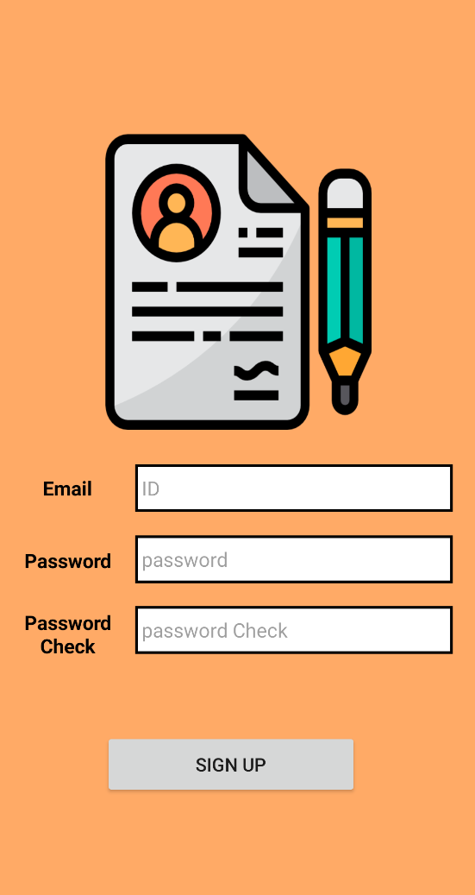
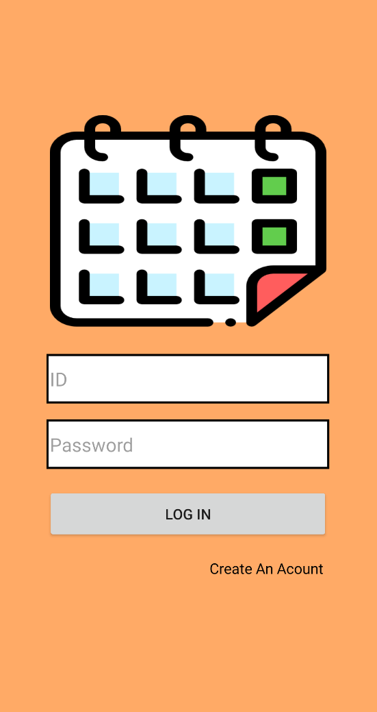
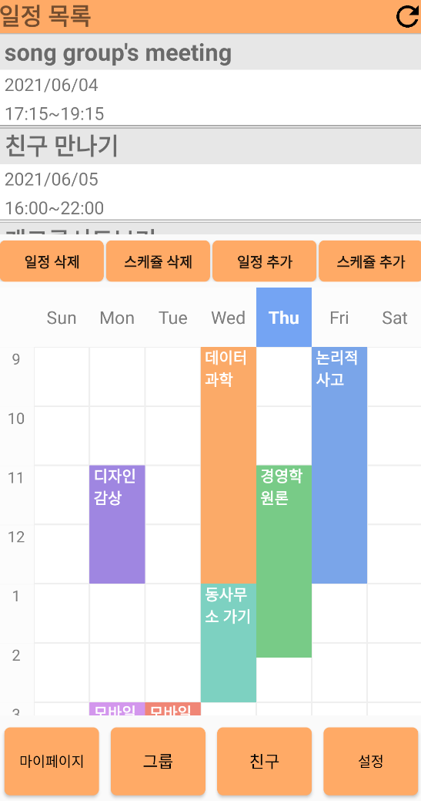
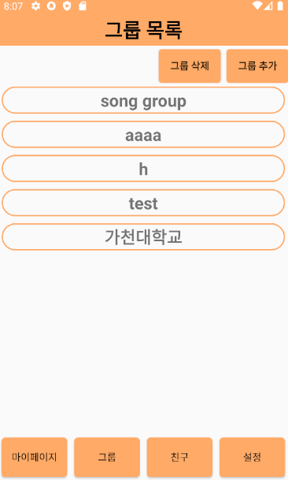
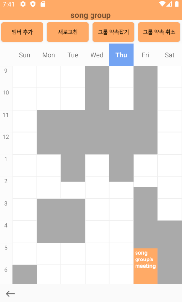
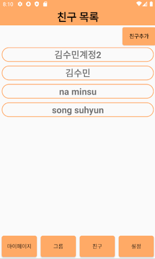
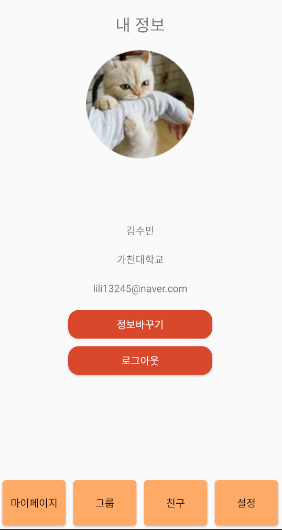

# TeamOne's Timetable App

Gachon University Software Department MobileProgramming course Term Project
This application makes you convenient to make appointments of team or friends based on your own timetables.
Make your timetable and make appointments easily with your group members!

# Features

There are 3 key feature functions in our app:
* Schedule Management
* Sharing timetable by group
* Make an appointment for group

## Schedule Management

You can make your own timetable to manage your schedule of week. You can manage not only regular schedules by timetable, but also temporary schedules by schedule memo block. 

## Sharing timetable by group

Our app works in groups created by users. You can make your own group and invite your friends. Group members can see another members' timetable and share schedules.

## Make an appointment for group

You can rename the current file by clicking the file name in the navigation bar or by clicking the **Rename** button in the file explorer.

# Layouts

Our app consists of 5 main scenes to serve functions above to user:
* Sign In/Sign Up Scene
* My Schedule Scene
* Group List and Group timetable Scene
* Friend List and Friend Information Scene
* Setting Scene

## Sign In/Sign Up Page

You should sign up for using our app by your e-mail address.

If you already signed up, you can sign in your ID.

## My Schedule Page

You can manage your timetable and temporary schedules in mypage fragement.

This scene divide two side, plan side for management of temporary schedule and timetable side for management of regular schedules.

## Group Page

You can make your group if you want to make an appointment for your team project, plan with friend, etc.

In this scene, show the list of groups you are participated and create or delete the group that you made.

If you click a group name, you can see this screen:  

You can see group timetable, gray part is assigned time, white part is empty time, and colored(orange) part is appointment time. You can also make an appointment by calculating empty time based on group timetable.

## Friend Page

Our app works in groups, groups work in friends. You can add your friends for making group.

In this scene, show the list of your friends and add or delete the friend.

If you click a friend name, you can see this pop-up:  

You can see friend's information.

## Setting Page

In addition, You can edit your information or log out in setting scene.

# License
This app is free to use and edit.
Original source code license: TeamOne(Department of Software, Gachon University)
